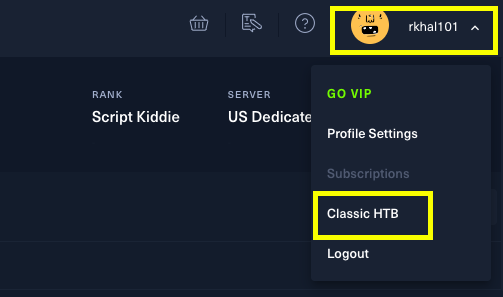
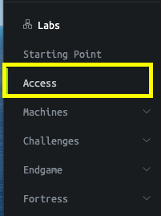
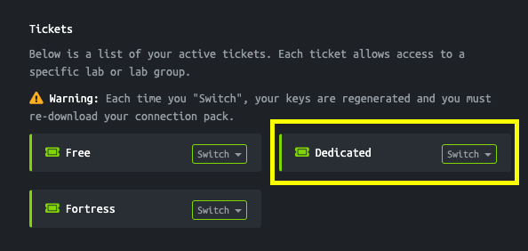
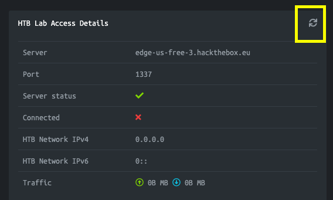
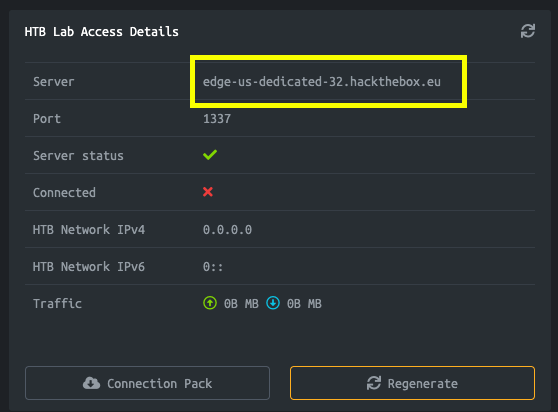
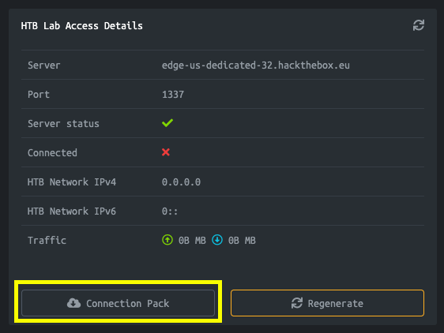
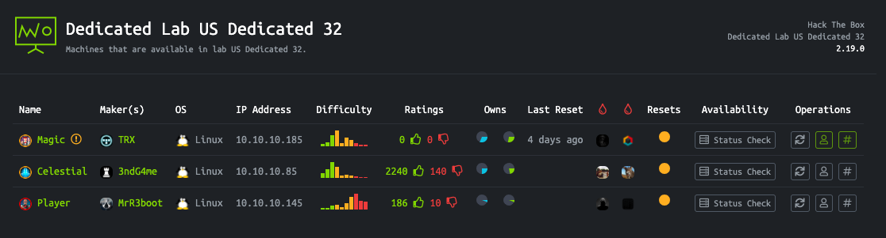
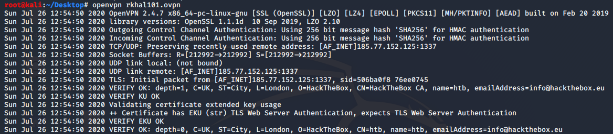

# How to Connect to the Dedicated Server
This document describes how to connect to the dedicated server for the HTB Ottawa meetups. 

## Step 1 – Switch to Classic HTB UI
If you have switched to the *New UI*, you need to switch back to the *Classic HTB* UI for the duration of this meetup.
This can be done by clicking on your username > select *Classic HTB*.




## Step 2 – Generate and Download Connection Path
In the menu on the left, click on *Access*.

 

 

Under the *Tickets* section, click on the *Switch* button on the Dedicated ticket and select the dedicated server *US Dedicated xx*.


 
 

When the switch is completed, click on the *Refresh* button.


 

 

Once refreshed, you should see the name of the server you connected to.


 

 

Then click on the *Connection Pack* button.


 

 


## Step 3 - Connect to the Dedicated Server

Run the following command.

```
openvpn <username>.ovpn
```

This should generate the following output.

 
 
 
 ## Step 4 - Test the Connection
 
 First, confirm that you've been given an IP address.
 
 ```
 root@kali:~# ifconfig      
 ....
 tun0: flags=4305<UP,POINTOPOINT,RUNNING,NOARP,MULTICAST>  mtu 1500
        inet 10.10.14.2  netmask 255.255.254.0  destination 10.10.14.2
        inet6 dead:beef:2::1000  prefixlen 64  scopeid 0x0<global>
        inet6 fe80::ce00:662a:f97:2c8f  prefixlen 64  scopeid 0x20<link>
        unspec 00-00-00-00-00-00-00-00-00-00-00-00-00-00-00-00  txqueuelen 100  (UNSPEC)
        RX packets 0  bytes 0 (0.0 B)
        RX errors 0  dropped 0  overruns 0  frame 0
        TX packets 1  bytes 48 (48.0 B)
        TX errors 0  dropped 0 overruns 0  carrier 0  collisions 0
 ```
 
 In the menu on the left, click on *Dedicated Labs* > select *US Dedicated xx*. There you'll see the list of available boxes on the dedicated server and the associated IP addresses.
 
  
  
  Ping one of the IPs to test the connection.
  
```
root@kali:~# ping 10.10.10.85
PING 10.10.10.85 (10.10.10.85) 56(84) bytes of data.
64 bytes from 10.10.10.85: icmp_seq=1 ttl=63 time=45.5 ms
64 bytes from 10.10.10.85: icmp_seq=2 ttl=63 time=37.6 ms
64 bytes from 10.10.10.85: icmp_seq=3 ttl=63 time=34.2 ms
64 bytes from 10.10.10.85: icmp_seq=4 ttl=63 time=51.0 ms
```
  
 

