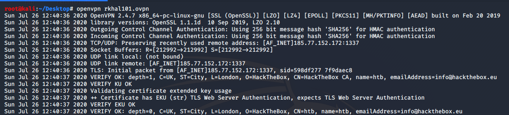

# How to Connect to the Dedicated Server
This document describes how to connect to the dedicated server for the HTB Ottawa meetups. 

## Step 1 – Switch to Classic HTB UI
If you have switched to the *New UI*, you need to switch back to the *Classic HTB* UI for the duration of this meetup.
This can be done by clicking on your username > select *Classic HTB*.


## Step 2 – Generate and Download Connection Path
In the menu on the right, click on *Access*.

 

 

Under the *Tickets* section, click on the *Switch* button on the Dedicated ticket and select the dedicated server *US Dedicated xx*.


 
 

When the switch is completed, click on the *Refresh* button.


 

 

Once refreshed, you should see the name of the server you connected to.


 

 

Then click on the *Connection Pack* button.


 

 


## Step 3 - Connect to the Dedicated Server

Run the following command.

```
openvpn <username>.ovpn
```

This should generate the following output.

 

